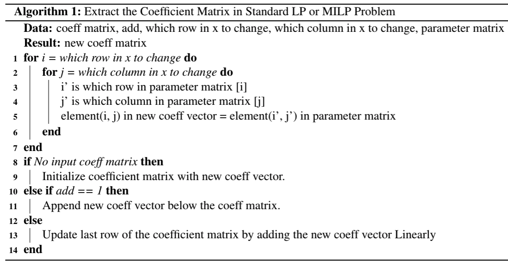

# CoeffMatrix
Julia Module to Extract the Coefficient Matrix in Standard LP or MILP Problem

To use the algorithm, like [BendersOptim](https://github.com/edxu96/BendersOptim) for better solving MILP or stochastic
programming, you have to convert the problem into standard form. The way to find the coefficient matrix for continuous
variables and integer variables is trivial and easy to make a mistake. This module can help you to generate the
coefficient matrix by sequential calculation.   

## Algorithm Description



## How it works

```Julia
function updateRow(; mat_coeff = 0, add = false, num_m, num_n, mat_a,
    vec_i_x, vec_j_x, vec_i_a = vec_i_x, vec_j_a = vec_j_x, inverse = false)
```

Default double-script order:
    |     n(j)|
    |m(i)  *  |

The default single-script order: (To bottom, then right)
```Julia
k = (j - 1) * m + i
```
To convert back to double-script order:
```Julia
i = k % m
j = Int8((k - i) / m)
```

The inversed single-script order: (To right, then bottom)
```Julia
k = (i - 1) * n + j
j = k % n
i = Int8((k - j) / n)
```

## Examples

For example, to generate a coefficient matrix with one row:  
```Julia
mat_a = [99.74  99.21  100.21  99.76  100.48  100.7  99.42  99.11  97.69  98.94  97.22  98.99;
         1.89   2.02   1.95    2.16   2.16    2.08   2.08   2.09   1.97   1.99   1.89   1.95;
         15.58  15.11  14.93   14.86  15.06   15.51  14.41  14.96  15.62  14.4   15.64  14.52]
(mat_coeff, mat_a_cal) = updateRow(num_m = 3, num_n = 12, mat_a = - hcat(mat_a[:,1]),
    vec_i_x = [1 2 3], vec_j_x = [1])
(mat_coeff, mat_a_cal) = updateRow(add = 1, mat_coeff = mat_coeff, num_m = 3, num_n = 12,
    mat_a = - mat_a, vec_i_x = [1 2 3], vec_j_x = collect(2: 1: 12))
(mat_coeff, mat_a_cal) = updateRow(add = 1, mat_coeff = mat_coeff, num_m = 3, num_n = 12,
    mat_a = mat_a, vec_i_x = [1 2 3], vec_j_x = collect(1: 1: 11), vec_j_a = collect(1: 1: 11) .+ 1)
```
which is the matrix form of the following constraint:
```Julia
@constraint(model, - sum(mat_a[i, 1] * x[i, 1] for i = 1: 3) - sum((x[i,t] - x[i, t-1]) * mat_a[i, t]
	for i = 1: 3, t = 2: 12) == 0)
```

***

Edward J. Xu  
edxu96@outlook.com  
Version: 2.0  
Date: April 7th, 2019  
